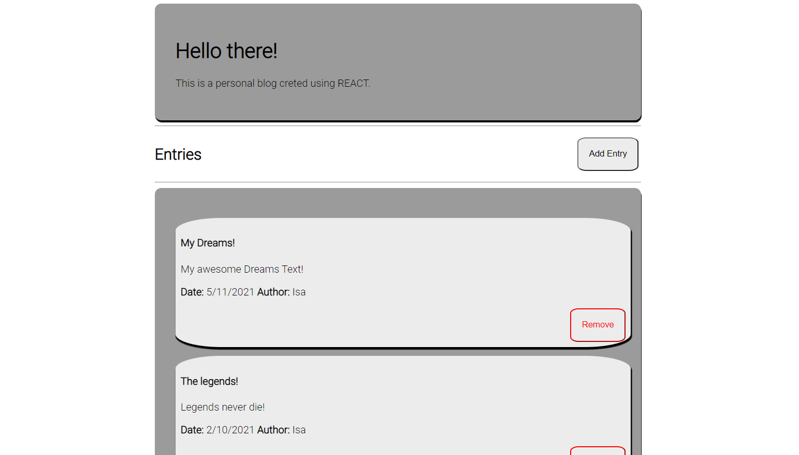
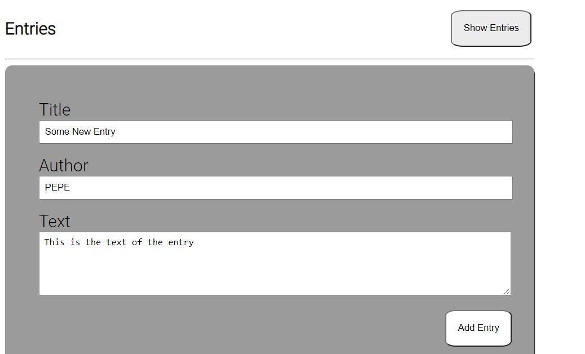

# About

This small proyect is a simple blog using basic react. There are 4 default entries and more entries can be added through the entry form. Each entry consist of a title, an author, a creation Date. Entries can be remove at any given time.

## Entries List

## Entries Form

